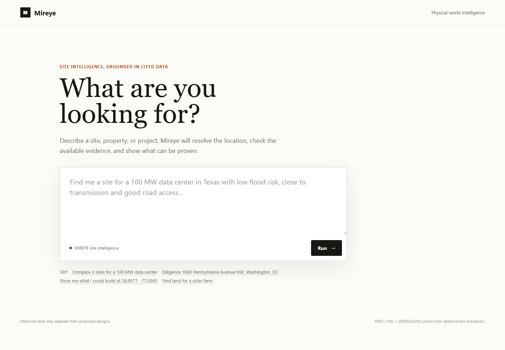
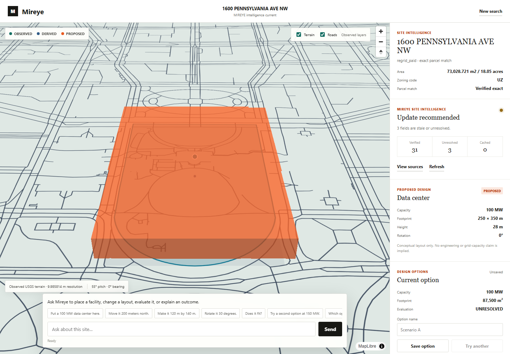

# MIREYE Site Intelligence and Sandbox

MIREYE is a FastAPI application for evidence-grounded site diligence and conceptual development planning. A user supplies candidate addresses or coordinates, the application resolves and enriches them through the live MIREYE API after an explicit credit confirmation, evaluates supported constraints deterministically, and opens a selected parcel in a MapLibre sandbox with real terrain, mapped roads, proposed facilities, scenario history, and source evidence.

The current product does **not** perform statewide inverse parcel discovery. Its production workflow compares customer-supplied candidates. The legacy `/v1/screen` route uses the bundled prototype dataset and is not used by the live diligence experience.





## What Works Today

- Plain-English project requests with supplied addresses, coordinates, and supported APN inputs.
- Typed constraint compilation with unsupported semantics reported as unresolved.
- Live MIREYE lookup, quote, confirmed batch enrichment, evidence provenance, and credit planning.
- Stable internal site identities with multiple immutable `SiteSnapshot` versions.
- Field-level freshness checks, selective refresh quotes, explicit confirmation, immutable T2 snapshots, and affected-scenario re-evaluation.
- Deterministic `PASS`, `FAIL`, and `UNRESOLVED` evaluation and ranking.
- Real USGS 3DEP terrain and release-pinned Overture road geometry in immutable `WorldSnapshot` records.
- MapLibre parcel, terrain, road, and proposed-development rendering.
- Persistent scenario revisions, branching, comparison, state hashes, and evidence dependencies.
- One constrained GPT-5.6 Sol agent for diligence and sandbox operations.

## Trust Boundary

| Layer | Meaning |
| --- | --- |
| `OBSERVED` | MIREYE or source-backed parcel facts and geometry |
| `DERIVED` | Deterministic calculations from observed evidence |
| `PROPOSED` | User or agent requested conceptual development objects |
| `GENERATED` | Reserved for future visual output; never authoritative |

The model plans and explains. Typed tools perform mutations. The evaluator alone decides `PASS`, `FAIL`, or `UNRESOLVED`. A mutation claim requires a validated changed state and persisted revision. An alternative layout additionally requires a state change and deterministic evaluation; after bounded retries the agent reports that no alternative was produced.

## Architecture

```text
Plain-English project request + supplied candidates
    -> constraint compiler
    -> candidate resolution
    -> MIREYE field plan and quote
    -> explicit application confirmation
    -> live batch enrichment
    -> immutable SiteSnapshots
    -> deterministic evaluation and ranking
    -> selected site
    -> immutable WorldSnapshot (USGS terrain + Overture roads)
    -> MapLibre sandbox
    -> GPT-5.6 Sol tool planning
    -> deterministic proposal tools and evaluator
    -> persistent scenario revisions and comparisons
    -> field freshness check
    -> confirmed MIREYE refresh -> new SiteSnapshot
```

Storage remains local and simple:

- SQLite stores workspaces, sites, immutable snapshots, evidence dependencies, spend plans, scenarios, and evaluation runs.
- Content-addressed files store downloaded and derived world artifacts.
- DuckDB and GeoParquet remain available for the legacy prototype discovery route.
- No microservices or frontend build toolchain are required.

## Requirements

- Python 3.10 or newer
- A MIREYE API key for live parcel intelligence
- An OpenAI API key for live agent chat
- Network access for MIREYE, OpenAI, USGS, Overture, and MapLibre assets

Install dependencies:

```powershell
python -m pip install fastapi uvicorn duckdb h3 httpx pydantic pytest python-dotenv shapely
python -m pip install -r requirements-world.txt
```

The frontend is vanilla HTML, CSS, and JavaScript. MapLibre GL JS is loaded by the application page; React and Three.js are not used.

## Configuration

Create `.env` in the repository root or set the same variables in the shell:

```ini
MIREYE_API_KEY=your_mireye_api_key
MIREYE_BASE_URL=https://api.mireye.com
OPENAI_API_KEY=your_openai_api_key
SANDBOX_AGENT_MODEL=gpt-5.6-sol
SANDBOX_AGENT_REASONING_EFFORT=high
```

`.env` and `*.db` are ignored by Git. Never commit credentials.

For direct development server runs, always select non-production storage:

```powershell
$env:WORKSPACE_DB = Join-Path $env:TEMP "mireye-development.db"
$env:WORLD_ASSET_DIR = Join-Path $env:TEMP "mireye-world-assets"
python -m uvicorn app.main:app --host 127.0.0.1 --port 8000 --reload
```

Open `http://127.0.0.1:8000/`.

For the shortest safe startup, use the included launcher. It creates a new temporary database and world-asset directory on every run:

```powershell
.\start.ps1
```

Use another port or enable development reload when needed:

```powershell
.\start.ps1 -Port 8001 -Reload
```

## Live Demo Paths

### One real parcel

Resolve one address, review the MIREYE quote, confirm the fetch, create an immutable snapshot and proposal, and start the application:

```powershell
python -m app.sandbox_demo --serve
```

Use `--confirm` only when non-interactive confirmation is intentional:

```powershell
python -m app.sandbox_demo --confirm --serve
```

Choose another address or port:

```powershell
python -m app.sandbox_demo --address "1510 E Lookout Drive, Richardson, TX 75082" --serve --port 8001
```

Unless `--db` is supplied, the command creates a new temporary SQLite database and refuses to use `app/data/workspaces.db`.

### Real parcel, terrain, and roads

```powershell
python scripts/live_world_snapshot_demo.py --confirm --serve
```

The flagship configuration uses `1 Tesla Road, Austin, TX 78725`, which previously resolved through MIREYE to the canonical parcel address `2025 1/2 ROBOTIC AVE` with approximately 1,698 acres. It is used because it provides credible industrial-scale spatial context; the demo does not claim that the parcel is suitable or available for data-center development.

The command creates a temporary database and content-addressed asset directory, fetches one confirmed MIREYE parcel, downloads a bounded USGS 3DEP DEM, extracts release-pinned Overture roads for the parcel AOI, and prints the exact sandbox URL.

### Supplied-candidate diligence

1. Start the development server with temporary storage.
2. Open the home page.
3. Enter a project brief and paste candidate addresses or coordinates.
4. Review resolution and the exact MIREYE field/credit plan.
5. Confirm enrichment.
6. Review the deterministic shortlist and unresolved risks.
7. Open a selected site in the sandbox.

No live MIREYE fetch occurs before confirmation.

## Data Semantics

The evaluator can prove narrowly scoped predicates when matching, fresh evidence exists:

- Parcel containment, setback, footprint area, parcel coverage, and blocked-geometry collision.
- Parcel NWI wetland acres or fraction against caller-supplied thresholds.
- Resolution-point FEMA flood status.
- Resolution-point slope against a supplied threshold.
- Resolution-point distance to the nearest substation, transmission line, or mapped major road.
- Exact normalized raw zoning-code membership in a caller-supplied allow-list.

The following remain unresolved unless additional authoritative evidence or explicit semantics are provided:

- Available grid or interconnection capacity.
- Parcel-wide or footprint-wide flood exclusion from point evidence.
- Parcel-wide or footprint-wide slope from point evidence.
- Generic "industrial zoning" without a jurisdiction-aware mapping.
- Legal road access, frontage, easements, or heavy-haul suitability.
- Engineering-grade grading, foundations, power flow, or construction feasibility.

MIREYE proximity evidence does not imply capacity or legal access. Overture road geometry is visual/spatial context and does not replace MIREYE evidence.

## Agent Model and Safety

The primary sandbox and diligence model is `gpt-5.6-sol` with high reasoning effort. It receives only strict typed tools and never receives unrestricted `MireyeClient` access.

- Metered MIREYE operations require an application-issued confirmation identifier.
- The model cannot mint confirmations or spend silently.
- Observed parcel geometry is immutable.
- Proposed geometry is created and transformed only by deterministic tools.
- Evaluation results and candidate ranking are deterministic.
- Failed or invalid tool calls create no scenario revision.
- Alternative-layout claims require changed proposal state plus `evaluate_scenario`.

## Tests

Normal tests are offline and must use temporary SQLite storage:

```powershell
$env:WORKSPACE_DB = Join-Path $env:TEMP ("mireye-tests-" + [guid]::NewGuid().ToString() + ".db")
python -m pytest -q
Remove-Item -LiteralPath $env:WORKSPACE_DB -Force -ErrorAction SilentlyContinue
```

Focused agent and scenario tests:

```powershell
python -m pytest -q tests/test_sandbox_agent.py tests/test_sandbox_scenarios.py
```

Opt-in live MIREYE contract and lifecycle validation:

```powershell
python scripts/live_mireye_demo.py
```

Normal `pytest` does not call the live MIREYE API. See [docs/live-mireye.md](docs/live-mireye.md) and [docs/sandbox-demo.md](docs/sandbox-demo.md) for live and manual validation procedures.

## API Overview

| Area | Endpoints |
| --- | --- |
| Product orchestration | `/v1/product/requests`, selection, confirmation |
| Candidate diligence | `/v1/diligence/projects`, candidates, plan, enrich, compare, watch, check-now, refresh, chat |
| Site lifecycle | `/v1/sandbox/site/resolve`, quote, snapshots, freshness, refresh, evaluate |
| World lifecycle | `/v1/sandbox/world-snapshots`, terrain tiles, roads |
| Sandbox agent | `/v1/sandbox/{snapshot_id}/chat` |
| Scenarios | create, branch, get, revisions, compare under `/v1/sandbox` |
| Existing platform APIs | `/v1/ask`, `/v1/screen`, `/v1/grid`, `/v1/workspace/*` |
| Service | `/health`, `/v1/usage`, `/v1/meta/fields`, `/docs` |

Interactive OpenAPI documentation is available at `http://127.0.0.1:8000/docs`.

## Current Limits

- Candidate enumeration is customer-supplied; no public MIREYE statewide inverse-search endpoint is assumed.
- The legacy `/v1/screen` dataset is synthetic prototype data and is kept separate from the live product workflow.
- Live batch enrichment is conservatively chunked to two locations because larger full-field batches returned inconsistent provider failures during validation.
- Terrain falls back from bounded 1 m acquisition to real 10 m USGS coverage when necessary.
- Proposed facilities are conceptual rectangular extrusions, not construction models.
- Scenario chat sessions are in memory, while accepted scenario revisions are persisted.
- Continuous watch scheduling is deferred; watch state and explicit check-now are available.

## Repository Map

```text
app/main.py                 FastAPI routes and same-origin frontend
app/mireye_client.py        Live MIREYE API adapter
app/diligence.py            Supplied-candidate orchestration and ranking
app/sandbox.py              SiteSnapshot lifecycle and scene construction
app/sandbox_evaluator.py    Deterministic geometry/evidence evaluation
app/sandbox_agent.py        Constrained GPT-5.6 Sol tool loop
app/sandbox_scenarios.py    Scenario persistence and comparison
app/world.py                WorldSnapshot, USGS terrain, Overture roads
app/workspace/store.py      Additive SQLite persistence
app/static/                 Product and sandbox UI
scripts/                    Opt-in live integration/demo commands
tests/                      Offline unit and integration coverage
```

## License

MIT License.
